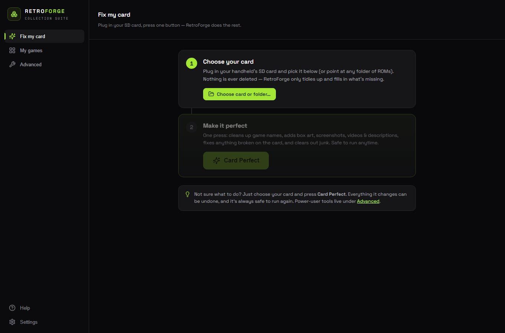
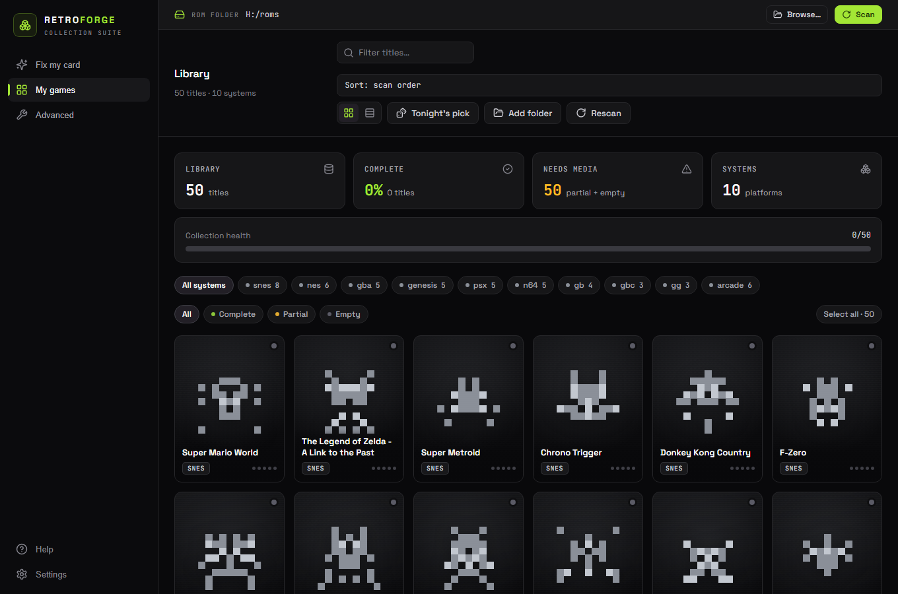

# RetroForge

**One-click cleanup for your retro-gaming cards.** RetroForge scans your ROM
collection, fills in box art, descriptions, genres, and cheats, fixes broken
gamelists and damaged files, tidies filenames, and gets your card ready for any
frontend — all from one desktop app.

Cross-platform standalone builds for **Windows, Linux, and macOS**. No install,
no setup — point it at your card and press one button.

## Why I built it

I made RetroForge for **no-WiFi handhelds** — the **R36Max / R36Max2** and the
whole family of budget clones (R36S, RG35XX-style). A lot of them have **no WiFi
at all**, and even the ones that do can't realistically scrape box art on-device.
So every game shows up as a bare filename with no cover. The sane fix is to prep
the card on your PC and flash it — but I couldn't find a tool that did the *whole*
job in one shot, with no accounts and no fuss. So I built one. It works for any
card and any frontend, but that's the itch it was made to scratch.

---

## 🔒 Your art library stays private (new in v0.6.0)

Cover art **and** game metadata are now delivered **encrypted** (AES-256-GCM).
The app fetches each encrypted image, decrypts it in memory, and writes the plain
picture only to your own card — the hosted links reveal neither the game title
nor the image itself, so the library can't be scraped or mirrored without the
app. Art looks exactly the same, with no added wait, and nothing about your
collection is ever uploaded.

---

## Download

Grab the latest build from the
[releases page](https://github.com/NookieAI/RetroForge/releases/latest):

| OS | File | Notes |
|----|------|-------|
| **Windows** | `RetroForge.exe` | Portable — runs from anywhere, no installer |
| **Linux** | `RetroForge-linux.AppImage` | Portable AppImage |
| **macOS** | `RetroForge-macos.dmg` | Standalone app |

---

## How it works

1. Download the build for your OS and run it — nothing to install.
2. Point it at your ROM folder or SD card.
3. Press **Card Perfect** for one-click, studio-quality cleanup — or open
   **Advanced** to run any single tool yourself.

Card Perfect runs the whole pipeline in order: quarantine unreadable files,
repair broken gamelists, download and adopt box art, fill descriptions and
genres (auto-translated to English), add cheats, tidy ALL-CAPS filenames, and
prune empty clutter. Everything is reversible — nothing is deleted, backups are
made before edits, and quarantined files can be restored by moving them back.

---

## What's new

### v0.6.0 — Encrypted art
- **Cover art and metadata are now encrypted (AES-256-GCM).** Links no longer
  reveal the game title or the image bytes, so the art library can't be scraped
  without the app. The app decrypts in memory and writes the plain image only to
  your card — the art looks identical, with no added wait. Metadata was already
  encrypted; now the pictures are too.

### v0.5.0 — Streamlined
- **"Fix my card" home screen** — a guided 2-step flow: choose your card, press
  one big Card Perfect button. Plain-language copy, reassurance built in.
- **Simpler navigation** — three tabs: **Fix my card · My games · Advanced**.
  Every power tool now lives under **Advanced**, so newcomers aren't overwhelmed.
- **Friendly first run** — a clean empty-state in **My games** points you
  straight to Card Perfect.
- **Much faster scanning** — a full 90 GB / 93k-file / 16.5k-game card now scans
  in about **2 seconds** (down from roughly 3 minutes).
- **Safety net** — the app refuses to run destructive steps on anything that
  isn't a ROM card.

---

## Supported systems

Box art, descriptions, genres, and cheats are available for a wide range of
systems, including:

- **Nintendo** — Game Boy, Game Boy Color, Game Boy Advance, NES / Famicom, SNES, Nintendo 64
- **Sega** — Genesis / Mega Drive, Master System, Game Gear
- **Sony** — PlayStation (PS1)
- **Arcade** — MAME, CPS1 / CPS2 / CPS3
- **Others** — Atari Lynx, ColecoVision, and more

RetroForge also builds the correct folder layout for popular handhelds and
frontends — **ArkOS, Rocknix, muOS, Knulli**, ES-DE, Batocera, RetroPie, and
others — and writes `.m3u` playlists for multi-disc games.

---

## What it can do

- **Card Perfect** — one-click, end-to-end cleanup of an entire card.
- **Box art** — downloads cover art for every matched game.
- **Descriptions & genres** — fills missing text and normalizes genres to English.
- **Cheats** — adds RetroArch cheat files where available.
- **Repair** — fixes broken gamelist XML, quarantines corrupt/unreadable files,
  and can run a filesystem check to recover a damaged card. Nothing is deleted.
- **Clean names** — turns ALL-CAPS filenames into proper titles (keeps II/III,
  NBA, RPG, and the like).
- **Tidy up** — removes empty folders and boot-slowing clutter, all reversible.
- **Export** — writes gamelists and media trees for ES-DE, Batocera, RetroPie,
  and more.

---

## Free — no account, no strings

RetroForge is **completely free**. No account, no sign-up, no license key, and
no telemetry. It pulls art and metadata from its own hosted library with nothing
to configure, and it never reports anything about your collection back to us.